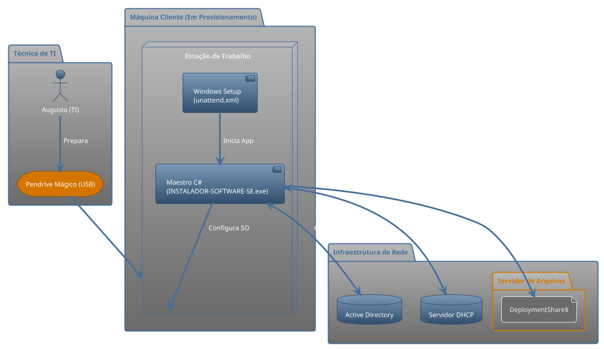
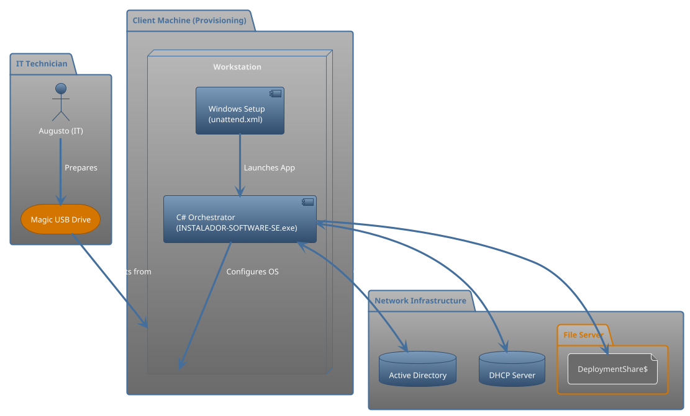

# 🚀 Projeto Piloto Automático: SE Promotora


> Um ecossistema de automação completo para o provisionamento "Zero-Touch" de estações de trabalho Windows no ambiente corporativo da SE Promotora.

---

## 🎯 Visão Geral

O **Projeto Piloto Automático** nasceu da necessidade de transformar o processo de formatação e configuração de máquinas – antes um fluxo de trabalho manual, demorado e propenso a erros – em um pipeline de automação robusto, padronizado e extremamente eficiente.

O objetivo é simples: reduzir a intervenção humana a um mínimo absoluto. O técnico de TI deve apenas dar o boot em uma nova máquina com a mídia preparada e, a partir de uma única tela de decisão, iniciar um processo que entrega uma estação de trabalho 100% pronta para o colaborador, atingindo um nível de **90% de automação**.

## ✨ Principais Funcionalidades

-   **Instalação Zero-Touch:** Formatação e instalação do Windows 10/11 de forma 100% autônoma utilizando um arquivo `unattend.xml` otimizado.
-   **Ciclo de Atualização Automático:** Orquestração de múltiplas reinicializações para garantir que o sistema operacional e os drivers estejam completamente atualizados via Windows Update antes de qualquer outra configuração.
-   **Configuração Dinâmica:** A aplicação não possui lógica de negócio "hardcoded". Todas as opções, perfis e listas de software são lidas em tempo real de um compartilhamento de rede centralizado (`DeploymentShare$`).
-   **Instalação de Software por Perfil:** Instalação automática de um conjunto específico de softwares (via **Winget** e instaladores legados) com base no setor do colaborador (TI, Financeiro, Vendas, etc.).
-   **Identidade e Domínio Seguros:** Geração inteligente de nomes de máquina e um processo de ingresso no domínio que solicita credenciais em tempo real, garantindo máxima segurança.
-   **Finalização e Limpeza:** Ao final do processo, a automação remove seus próprios rastros, desabilita contas de setup e entrega uma máquina limpa e segura.

## 🏛️ Arquitetura da Solução

A plataforma é construída sobre quatro pilares fundamentais que trabalham em conjunto para garantir flexibilidade e robustez.



1.  **O Pendrive Mágico (Fase 0):** Um pendrive de boot com uma imagem do Windows e o arquivo `unattend.xml`. Ele é a única intervenção física necessária, responsável por formatar a máquina e iniciar o "Maestro C#".
2.  **O Maestro C# (A Aplicação):** O coração da orquestração. É uma aplicação Windows Forms que guia o técnico, gerencia o estado da automação através de múltiplas reinicializações (usando o Registro do Windows) e chama os scripts para executar as tarefas pesadas.
3.  **O Cérebro Central (DeploymentShare$):** Um compartilhamento de rede que funciona como o "almoxarifado digital" do projeto. Ele contém:
    * **Configs JSON:** Arquivos que ditam as opções da UI e os perfis de software.
    * **Scripts PowerShell:** Toda a lógica de execução.
    * **Instaladores Legados:** Repositório para softwares que não estão no Winget.
4.  **Os Músculos (Scripts PowerShell):** Um conjunto de scripts modulares e especializados, cada um com uma única responsabilidade (ex: ingressar no domínio, instalar impressoras), que são chamados pelo Maestro.

## 🛠️ Pré-requisitos

-   **Servidor:** Windows Server (2016 ou superior) com Active Directory e DHCP.
-   **Compartilhamento de Rede:** Uma pasta compartilhada (`DeploymentShare$`) com permissões de leitura para `Authenticated Users` e controle total para a equipe de TI.
-   **Mídia de Instalação:** Uma ISO oficial do Windows 10 ou 11.
-   **Ferramentas:** Windows ADK (para customizações do `unattend.xml`, se necessário).
-   **Desenvolvimento:** Visual Studio 2022 com a carga de trabalho .NET e o .NET 8 SDK.

## 🚀 Guia de Instalação e Uso

### 1. Configuração do Servidor (DeploymentShare$)

1.  Crie o compartilhamento de rede (ex: `\\seu-servidor\DeploymentShare$`).
2.  Popule o compartilhamento com a estrutura de pastas e arquivos definidos no projeto (veja a seção *Estrutura do Projeto* abaixo).
3.  Edite os arquivos de configuração `.json` na pasta `Config/` para refletir as unidades, setores, usuários e softwares da sua empresa.
4.  Revise e ajuste os scripts `.ps1` na pasta `Scripts/`, principalmente os parâmetros com nomes de servidores e domínios.

### 2. Preparação da Mídia de Boot (Pendrive)

1.  Use a "Ferramenta de Criação de Mídia" da Microsoft ou o Rufus para criar um pendrive de instalação bootável do Windows.
2.  Copie o arquivo `autounattend.xml` (gerado e refinado) para a raiz do pendrive.
3.  Na raiz do pendrive, crie a estrutura de pastas: `$OEM$\$$\Support`.
4.  Compile a aplicação C# em modo `Release`.
5.  Copie **todo o conteúdo da pasta `bin/Release`** da sua aplicação C# e o arquivo `network_config.json` (gerado a partir do `network_config.sample.json`) para dentro da pasta `Support` no pendrive.

### 3. Processo de Provisionamento

1.  Conecte o pendrive na máquina a ser formatada.
2.  Inicie a máquina e dê o boot a partir do pendrive.
3.  **Aguarde.** O processo de instalação do Windows será 100% automático. Ao final, a máquina reiniciará e a aplicação "Maestro C#" será iniciada.
4.  Na tela da aplicação, selecione o Perfil/Unidade, o modo de nomenclatura, o Setor e o Usuário Final.
5.  Clique em **"Iniciar Configuração"**.
6.  A automação assumirá o controle. A máquina passará por múltiplas fases e reinicializações até que a mensagem final de sucesso seja exibida.

## 📁 Estrutura do Projeto

```
.
├── 📁 INSTALADOR-SOFTWARE-SE/ (Projeto C#)
│   ├── 📁 Fases/               # Classes que orquestram cada fase da automação.
│   ├── 📁 Helpers/              # Classes de ajuda (Gerenciador de Estado, de Rede).
│   ├── 📁 Models/               # Classes que espelham a estrutura dos arquivos JSON.
│   └── Form_Tela_Principal.cs  # Código principal da interface e do orquestrador.
│
├── 📁 DeploymentShare$/ (No Servidor)
│   ├── 📁 Applications/         # Repositório de instaladores legados (.msi, .exe).
│   ├── 📁 Config/               # Coração da configuração dinâmica (todos os .json).
│   └── 📁 Scripts/              # Arsenal de scripts PowerShell (.ps1).
│
└── 📄 autounattend.xml           # Arquivo de resposta para instalação autônoma do Windows.
```

## ⚙️ Customização e Configuração

A maior vantagem deste projeto é a sua flexibilidade. Para adaptar a automação às suas necessidades, edite os arquivos JSON na pasta `DeploymentShare$\Config`:

-   **`master_config.json`:** Adicione ou remova unidades, setores e usuários que aparecerão na interface do técnico.
-   **`{unidade}_{setor}.json`:** Para um perfil específico, adicione ou remova:
    -   Pacotes na lista `wingetPackages`.
    -   Instaladores na lista `legacyInstallers`.
    * Caminhos de impressora na lista `printers`.
    * Grupos locais na lista `localGroups`.
    -   Copie o arquivo `network_config.sample.json` para `network_config.json` e ajuste os endereços IP conforme sua rede.

**Exemplo:** Para adicionar o Notepad++ ao perfil de TI, basta adicionar a linha `"Notepad++.Notepad++"` à lista `wingetPackages` no arquivo `matriz_ti.json`. A mudança terá efeito imediato na próxima máquina provisionada.

---

## ✒️ Autor

**Augusto** - *Analista de Suporte & Arquiteto da Solução*

> Este projeto é um exemplo prático de como a automação pode revolucionar os fluxos de trabalho de TI, gerando eficiência, padronização e segurança.


# 🚀 Project Autopilot: SE Promotora


> A complete automation ecosystem for the "Zero-Touch" provisioning of Windows workstations in the SE Promotora corporate environment.

---

## 🎯 Overview

**Project Autopilot** was born from the need to transform the machine formatting and configuration process—once a manual, time-consuming, and error-prone workflow—into a robust, standardized, and extremely efficient automation pipeline.

The goal is simple: to reduce human intervention to an absolute minimum. The IT technician should only need to boot a new machine from the prepared media and, from a single decision screen, initiate a process that delivers a workstation 100% ready for the employee, achieving a **90% automation level**.

## ✨ Key Features

-   **Zero-Touch Installation:** 100% unattended formatting and installation of Windows 10/11 using an optimized `unattend.xml` file.
-   **Automated Update Cycle:** Orchestration of multiple reboots to ensure the operating system and drivers are fully updated via Windows Update before any other configuration.
-   **Dynamic Configuration:** The application has no hardcoded business logic. All options, profiles, and software lists are read in real-time from a centralized network share (`DeploymentShare$`).
-   **Role-Based Software Installation:** Automatic installation of a specific set of software (via **Winget** and legacy installers) based on the employee's department (IT, Finance, Sales, etc.).
-   **Secure Identity & Domain Join:** Intelligent machine name generation and a domain join process that prompts for credentials in real-time, ensuring maximum security.
-   **Finalization and Cleanup:** At the end of the process, the automation removes its own traces, disables setup accounts, and delivers a clean and secure machine.

## 🏛️ Solution Architecture

The platform is built on four fundamental pillars that work together to ensure flexibility and robustness.



1.  **The Magic USB Drive (Phase 0):** A bootable USB drive with a Windows image and the `unattend.xml` file. It's the only physical intervention required, responsible for formatting the machine and launching the "C# Orchestrator."
2.  **The C# Orchestrator (The Application):** The heart of the orchestration. It's a Windows Forms application that guides the technician, manages the automation state across multiple reboots (using the Windows Registry), and calls external scripts to perform the heavy lifting.
3.  **The Central Brain (DeploymentShare$):** A network share that acts as the project's "digital warehouse." It contains:
    * **JSON Configs:** Files that dictate UI options and software profiles.
    * **PowerShell Scripts:** All the execution logic.
    * **Legacy Installers:** A repository for software not available on Winget.
4.  **The Muscles (PowerShell Scripts):** A suite of modular, specialized scripts, each with a single responsibility (e.g., joining the domain, installing printers), which are called by the Orchestrator.

## 🛠️ Prerequisites

-   **Server:** Windows Server (2016 or higher) with Active Directory and DHCP services.
-   **Network Share:** A shared folder (`DeploymentShare$`) with read permissions for `Authenticated Users` and full control for the IT team.
-   **Installation Media:** An official Windows 10 or 11 ISO.
-   **Tools:** Windows ADK (for `unattend.xml` customizations, if needed).
-   **Development:** Visual Studio 2022 with the .NET desktop development workload and the .NET 8 SDK.

## 🚀 Setup and Usage Guide

### 1. Server-Side Setup (DeploymentShare$)

1.  Create the network share (e.g., `\\your-server\DeploymentShare$`).
2.  Populate the share with the folder and file structure defined by the project (see *Project Structure* section below).
3.  Edit the `.json` configuration files in the `Config/` folder to reflect your company's units, departments, users, and software.
4.  Review and adjust the `.ps1` scripts in the `Scripts/` folder, especially parameters with server and domain names.

### 2. Boot Media Preparation (USB Drive)

1.  Use the Microsoft Media Creation Tool or Rufus to create a bootable Windows installation USB drive.
2.  Copy your refined `autounattend.xml` file to the root of the USB drive.
3.  In the root of the USB drive, create the folder structure: `$OEM$\$$\Support`.
4.  Compile the C# application in `Release` mode.
5.  Copy the **entire contents of the `bin/Release` folder** from your C# project and the `network_config.json` file (created from `network_config.sample.json`) into the `Support` folder on the USB drive.

### 3. Provisioning Process

1.  Plug the USB drive into the machine to be formatted.
2.  Turn on the machine and boot from the USB drive.
3.  **Wait.** The Windows installation process will be 100% unattended. Afterward, the machine will reboot and the "C# Maestro" application will launch.
4.  On the application screen, select the Profile/Unit, naming mode, Department, and End User.
5.  Click **"Start Configuration"**.
6.  The automation will take over. The machine will go through multiple phases and reboots until the final success message is displayed.

## 📁 Project Structure

```
.
├── 📁 INSTALADOR-SOFTWARE-SE/ (C# Project)
│   ├── 📁 Fases/               # Classes that orchestrate each automation phase.
│   ├── 📁 Helpers/              # Helper classes (State Manager, Network Manager).
│   ├── 📁 Models/               # Classes that mirror the structure of the JSON files.
│   └── Form_Tela_Principal.cs  # Main form and orchestrator logic.
│
├── 📁 DeploymentShare$/ (On the Server)
│   ├── 📁 Applications/         # Repository for legacy installers (.msi, .exe).
│   ├── 📁 Config/               # Heart of the dynamic configuration (all .json files).
│   └── 📁 Scripts/              # Arsenal of PowerShell scripts (.ps1).
│
└── 📄 autounattend.xml           # Answer file for unattended Windows installation.
```

## ⚙️ Customization and Configuration

The greatest advantage of this project is its flexibility. To adapt the automation to your needs, edit the JSON files in the `DeploymentShare$\Config` folder:

-   **`master_config.json`:** Add or remove units, departments, and users that appear in the technician's UI.
-   **`{unit}_{sector}.json`:** For a specific profile, add or remove:
    -   Packages in the `wingetPackages` list.
    -   Installers in the `legacyInstallers` list.
    -   Printer paths in the `printers` list.
    -   Local groups in the `localGroups` list.
    -   Copy `network_config.sample.json` to `network_config.json` and edit the IP addresses to match your network.

**Example:** To add Notepad++ to the IT profile, simply add the line `"Notepad++.Notepad++"` to the `wingetPackages` list in the `matriz_ti.json` file. The change will take effect immediately for the next machine provisioned.

---

## ✒️ Author

**Augusto** - *Support Analyst & Solution Architect*

> This project is a practical example of how automation can revolutionize IT workflows, driving efficiency, standardization, and security.
